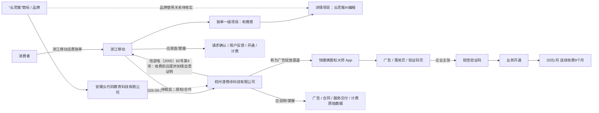

# 案件关系图

## 三个主体分别要回答什么

### 浙江移动
核心问题：**为什么给这个号码开通并持续代收费？**
- 用户申请订购记录；
- 开通前请求确认完整内容；
- 用户确认反馈；
- 验证码与具体订单/业务代码的绑定；
- SP、SP代码、服务接入代码、业务代码；
- 开通及计费；
- “和教育”与“云灵猴AI编程”的关系；
- SP在代收费前向移动提供了什么“知情、自愿”证明；
- SP接入资质核验结论。

### 杭州漫卷诗
核心问题：**到底卖了什么、怎么卖、交付了什么？**
- 电子订单/用户协议；
- 产品内容；
- 网站/App/小程序/H5；
- 用户账号和使用记录；
- “快捷换图标大师”广告、落地页、订购页；
- 计费原始数据/收费清单；
- SP许可证基本信息；
- 云灵猴品牌授权关系；
- 向浙江移动提交过何种“知情、自愿”证明资料。

### 安徽云代码
核心问题：**杭州漫卷诗为何可以使用“云灵猴”？**
- 是否开发/经营“云灵猴AI编程”；
- 是否授权杭州漫卷诗使用“云灵猴”；
- 是否授权其经营、推广或通过移动话费收费；
- 双方是否存在内容/品牌/业务合作。

## 三个根问题

1. **我到底同意购买了什么？**
2. **谁实际向我提供了什么？**
3. **20元/月持续收费的事实和法律依据是什么？**